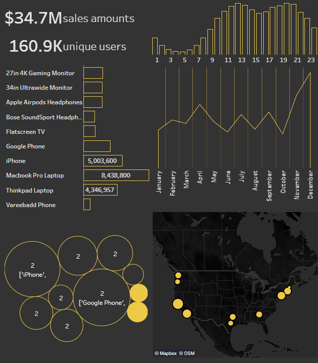

# Mock Data to Dashboard

The objective of this project is to create a sales dashboard poc

### Folder Structure

```
.
├─ .gitignore
├─ data                             <- Raw data destination
│  ├─ 2020_Sales.csv                <- Cleaned data after analysis
│  ├─ Sales_April_2020.csv
│  ├─ Sales_August_2020.csv
│  ├─ Sales_December_2020.csv
│  ├─ Sales_February_2020.csv
│  ├─ Sales_January_2020.csv
│  ├─ Sales_July_2020.csv
│  ├─ Sales_June_2020.csv
│  ├─ Sales_March_2020.csv
│  ├─ Sales_May_2020.csv
│  ├─ Sales_November_2020.csv
│  ├─ Sales_October_2020.csv
│  └─ Sales_September_2020.csv
├─ README.md
├─ sales_analysis.ipynb             <- Data analysis and initial visualization
├─ sales_dashboard.twb              <- Data visualization
└─ src
   ├─ data
   │  ├─ create_sales_data.py       <- Generate sales data
   │  ├─ csv_to_db.py               <- Import data to server scripts
   │  ├─ mysql_dump.sql             <- Import data using backup data
   │  └─ README.md                  <- Import data via command line and create backup
   └─ img
      └─ sales_dashboard.png

```

### The Dashboard [👀](https://public.tableau.com/views/Book1_16216000778710/SalesDashboard)



This dashboard designed to answer these questions:

- What was the best month for sales? How much was earned that month?
- Which city had the highest sales?
- On which day and when is the best time to advertise?
- Which products are most often sold together?
- Which product sold the most?
